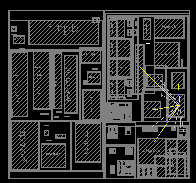

# cdl-2020-hackathon

This repository is created for participatoin to the hackathon of the 2020 [Quantum stream of Creative Destruction Lab](https://www.creativedestructionlab.com/streams/quantum/).
We have taken the challenge by DWave to address our first attempts of floorplanning design. Floorplanning is used in electronic design automation (EDA) for schematics representation of tentative placement of major functional blocks in an integrated circuit.  

System large-scale integration (LSI) or system-on-a-chip (SoC) is an essential device in today’s highly sophisticated information society. System LSI is already used widely in the world such as personal computers, servers, mobile phones, automobiles, and consumer electronics. Many SoCs with higher information processing are expected to be more and more needed. In these kinds of system designs, it is required to design a high-performance and small area of a system LSI with a lower cost and a shorter time period. A chip planner is a central tool in hierarchical top-down very-large-scale integration (VLSI) design. The set of the transistors of a circuit is assumed to be divided into so-called `cells` in form of a hierarchical wiring diagram. The chip planner is meant to place the cells of one hierarchy level onto a given area nearly optimally.

Floorplanning is an instance of the so called bin packing or pallet loading problem.   
Other applications include: 
- _cutting stock_ problem 
- _filling up containers_ 
- _loading with weight capacity constraints_ 
- _creating file backups in media_  
- other _technology mappings in semiconductor chip design_.
 
## This repository contains:
- Code for formulating a QUBO instance of rectangle packing problem in `models` directory
- Code for running the the QUBO on DWave machine or simulators or hybrid in `dwave` directory`
- Tools for vizualization in the `palnner` directory
- A jupyter notebook for a demo
