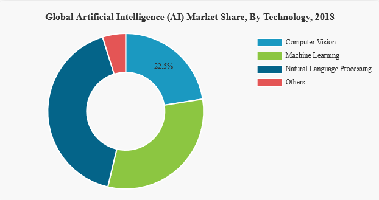

# CDL Quantum Hackathon 2020

We took the Machine Learning challenge from Xanadu and combined it with the challeges presented by IBM in order to present a complete construction of a QGAN. This network was trained with labeled data for 1 qubit in order to generate states with different Sz projections, with the discriminator and the generator optimized in different devices. In order to use this system for more realistic analysis, we showed how to embed the images from the galaxys presented by IBM into 14 qubits circuits, showing with PCA that the compression can be done with almost no loss. 
We also explored the Zapata platform, by performing QAOA methods with different optimizers.

## [Xanadu](Xanadu)’s:

### Machine Learning Challenge:
PennyLane: Implement a QGAN and run it on two separate quantum computing backends, using one platform as a generator and the other as a discriminator.

[Link to Resolution](Xanadu)

## [IBM](IBM) Q’s:
Morphological classification is key in our understanding of the large-scale structure of the universe. The use of Machine Learning for analyzing astrophysical datasets is on the rise [[1](https://arxiv.org/abs/1910.00774)] and it is expected next generation of instruments (LSST, SKA etc …) will generate bigger than ever datasets [[2](https://doi.org/10.1093/mnras/stz3006)]
Quantum Image Processing (QIMP) is an emerging field of Quantum Information Processing and can provide speedup over their classical counterparts [[3](https://arxiv.org/abs/1801.01465)] and we have seen progress in the Quantum  Machine Learning field as well.
The challenge is as follow:
Using an existing dataset (for example [[4](https://data.galaxyzoo.org/)] and one of the known image representation (FRQI [[5](https://pdfs.semanticscholar.org/0a3b/dfb66973144792533d763e9edaec40b2785b.pdf)] or NEQR [[6](https://www.researchgate.net/publication/257641933_NEQR_A_novel_enhanced_quantum_representation_of_digital_images)] for example), apply Quantum machine learning algorithms for galaxy classification.

[Link to Resolution](IBM)

## [Zapata](Zapata) Computing’s:
Working with Variational Quantum Algorithms (VQA) often means trying a lot of different ideas and benchmarking them against each other. In this challenge we would like you to integrate/implement some elements of VQA – optimizer, ansatz, measurement strategy, etc. – into Orquestra and benchmark it using other existing methods.
Example of a project could be to use QAOA to solve Maximum Independent Set problem. You could implement the Model Gradient Descent optimizer (described here: https://arxiv.org/abs/2004.04197, appendix D) and compare it to optimizers such as Nelder-Mead, L-BFGS-B and SPSA (all available in Orquestra), using standard cost function as well as CVaR (described here: https://arxiv.org/abs/1907.04769).

[Link to Resolution](Zapata)

## Business application:

Artificial intelligence is among the fastest growing markets in the world [[1](https://www.fortunebusinessinsights.com/industry-reports/artificial-intelligence-market-100114)]. In 2019, the estimated market size was around 39.9 billion dollars [[2](https://www.grandviewresearch.com/industry-analysis/artificial-intelligence-ai-market)]. Approximately ⅔ of the market size is composed by Computer Vision [[3](https://www.verifiedmarketresearch.com/product/global-computer-vision-market-size-and-forecast-to-2025/)] (image recognition) and Natural Language Processing [[4](https://www.prnewswire.com/news-releases/natural-language-processing-nlp-market-size-is-projected-to-reach-usd-27-6-billion-by-2026---valuates-reports-301091047.html)]. 

These trends have been amplified by the COVID-19 situation. Many hospitals and e-commerce have adopted Natural Language Processing for dealing with ever increasing online queries from customers, among other solutions [[5]()].  

Generative models are not only attracting lots of attention from these industries, but also generating new ones [[6]()]. The full potential of generative models is yet to be discovered, but there are no doubts about its capacities. Some of the possible applications are

- Language generation
  - Code and text generation: A state of the art problem in software development, with enormous potential [[7]()]
  - Automated customer service centers: Automation is fundamental for scaling ecommerce and other online services without large sums of money [[8]()]
- Molecular state creation
  - Drug discovery: Semi supervised GANs have been used to predict binding affinity [[9]()]
  - Materials research: New material designs, complex to do with classical methods [[10]()]
- Imagenes
  - VFX: Realistic face generation was one of the first applications of GANs, with astonishing results [[11]()]
  - Dynamic identikits: Both face rejuvenation and face aging have been extensively explored [[12]()]
- Marketing and ecommerce
  - Price determination and product segmentation: Many applications are being explored in this regards [[13]()]
  - Advertising content: Experiments running on Airbnb have optimized Houses description with GANs and improve overall impact [[14]()].
  - Recommendations: single-user recommendations with high efficiency [[15]()]
  - Fashion with personalized virtual manikin [[16]()]: There are studies showing how portraying fashion on real sized models could boost the sales up to 300% in certain groups [[17]()] .

Most of these problems have to deal with large datasets and structures which might be hard to achieve by classical computers. Quantum technologies are theoretically capable of dealing with linear algebra problems with exponential speed ups, allowing us to go beyond any classical solution. These kinds of problems are among the few that can already be studied in NISQ devices and it would be reasonable to think that they can reach customers in a middle term scenario.

Potential customers include big companies interested in technological innovation running along many industries CVS Health, Pfizer, Warner Bros and Amazon.

At Quantum Hack we envision a future where AI makes our lives easier. To unlock its full potential we must go quantum.
