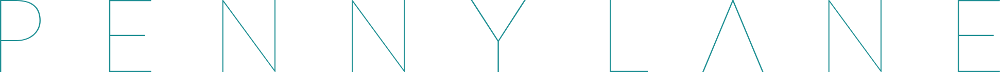
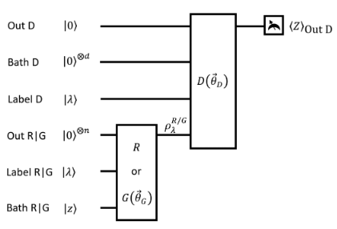
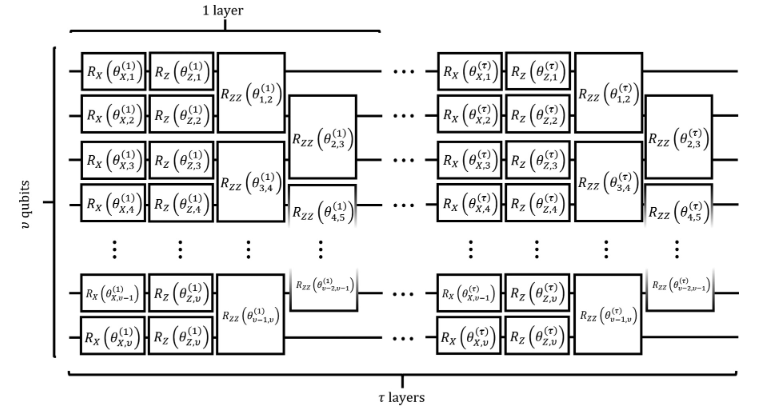

# [PennyLane](https://pennylane.ai/)

Implement a QGAN and run it on two separate quantum computing backends, using one platform as a generator and the other as a discriminator.

# Quantum generative adversarial networks:

Deep neural networks are on the spotlight on the search for a realistic artificial intelligence. Among many methods, generative adversarial networks (GANs) have shown astonishing results in generative related tasks. These problems scale up pretty quickly and classical computers struggle to keep up. 
On the other hand, quantum computation is known to provide enormous speed ups for many problems, especially those related directly with linear algebra. And even though hardware is still in an early stage, there exist already many practical near term developments , such as VQE. Neural networks are really efficient even with a small number of nodes, as long as it is deep enough. Low qubits systems could provide very good results if enough gates are used.

QGANs is the quantum version of GANs. The idea is the same: generate new datasets which follow certain patterns. In order to do this, GANs implement two competing networks: a discriminator and a generator. On the one hand the discriminator has the task to determine which datasets are real and which are false. On the other hand the generator tries to fool the discriminator with the datasets that it generates. Both networks are trained and compete, until reaching an equilibrium with non-zero sum. At this point, the generator is able to create datasets with a quality such that it fools a very well trained discriminator. 
QGANs work exactly the same way. We will be working with quantum states as dataset (which might even represent embedded classical data, as we will see later on), and trainable quantum circuits, which will represent the generators and discriminators. We will train parameters from the circuit in order to discriminate and generate new states efficiently. Moreover, we will introduce labeled dataset in order to generate different types of results. For instance, with labeled data we would be able to generate datasets with different properties on demand.

The structure of the neural network would look like this:

Here Out D is an auxiliary qubit used for measuring in order to determine how well the system is performing. Bath D is an additional register and Label is the label we want to generate. Out R|G is the register where the quantum state is generated, Label R|G are the labels imputed to the state we want to generate and Bath R|G are noise inputs used for generating different results given the same input.

We will train the system in two steps, where each step is performed in a different quantum device. In the first step, we will train the discriminator by updating its parameters and minimizing the cost function given by 

Cost = Prob(Detect True|Fake) - Prob(Detect true|true)

This quantity is measured as the Sz projection on the Out D register and is runned on `cirq.simulator`.
On the second step, we will train the generator by minimizing the cost function
Cost = - Prob(Detect True|Fake)
This quantity is also measured by the Sz projection on the Out D register but with a different circuit construction, and is runned on `qiskit.aer`.

Both the generator and the discriminator are built with similar layered structure. Each layer consists of single qubits Rx(theta1) and Rz(theta2) rotations, and an entangling gate RZZ(theta3) between each qubit and the following.

Our circuit was built for generating eigenstates of Sz. The label will dictate whether I want to to generate a |0> state or a |1> state. In order to accomplish this, we would expect that our generating circuit applies a control not operation conditioned on the labeled. This behavior should emerge from the minimization of the angles. The total system has 4 qubits: Out D, Label D, Out R|G and Label R|G. Two of these qubits go into the generator, and three (we reuse Out R|G) to the discriminator. 
We recreated the results from the original paper, where 4 layers were employed for the discriminator and 2 for the generator, accounting for 42 total angle parameters. 

In order to fully unlock the potential of GANs, it is necessary to consider the case where quantum states embed classical data.  This is a fundamental issue that was addressed in the [IBM directory](https://github.com/quantumhack/quantumhackthon/tree/master/IBM).

References: 

- Dallaire-Demers, P. L., & Killoran, N. (2018). Quantum generative adversarial networks. Physical Review A, 98(1), 012324.

- Lloyd, S., & Weedbrook, C. (2018). Quantum generative adversarial learning. Physical review letters, 121(4), 040502.

