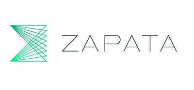
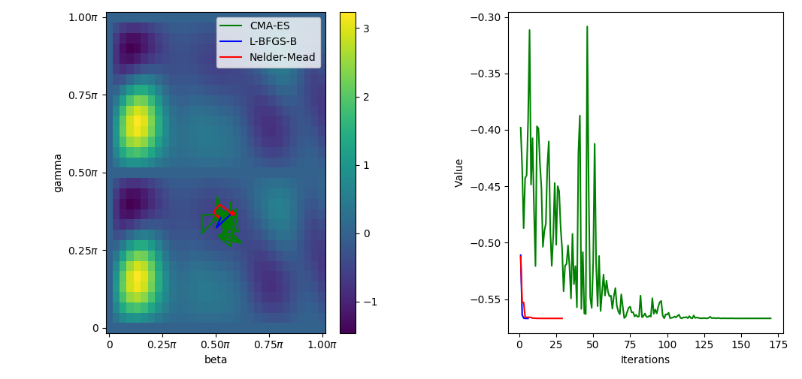

# Quantum Approximation Optimization Algorithm with [Orquestra](https://www.zapatacomputing.com/orquestra/)

Orquestra is a platform for performing computations on quantum computers developed by [Zapata Computing](https://www.zapatacomputing.com).

Quantum Approximate Optimization Algorithm (QAOA) is a variational quantum algorithm which allows to solve combinatorial optimization problems.

* Translate our problem into an Ising Hamiltonian
* Prepare QAOA ansatz
* Optimize the parameters for the ansatz.

Here we’ll focus only on the last step – optimization.

QAOA ansatz consists of several layers, sometimes called “steps”, each layer parametrized by two parameters: β and γ, which we also call angles. The goal of the optimization step is to find such values of the angles which minimize the cost function. In our case the problem at hand is MaxCut problem – we try to divide a graph into two groups in such way, that the sum of the weights of the edges going between the groups is as big as possible.

We will see how to solve this problem using layer-by-layer optimization and how we can use Orquestra to compare different optimizers.
In order to do this we used `z-quantum-qaoa` that is a module with basic implementation of Quantum Approximate Optimization Algorithm (QAOA).

Currently it includes the following features:
- Creating ansatz from the [Farhi's 2014 paper](https://arxiv.org/abs/1411.4028).
- Creating Hamiltonian for solving MaxCut problem given a graph.
- Solving MaxCut problem using exhaustive search.

# Running optimizers in parallel

Orquestra has the flexibility that changing optimizer-specs field in your workflow you can try out many different optimizers in parallel.

# Analyzing the results

We obtain the results from the workflow as a JSON file and replacing it in the python script [optimizers.py](results) we can plot the optimization trajectories.

