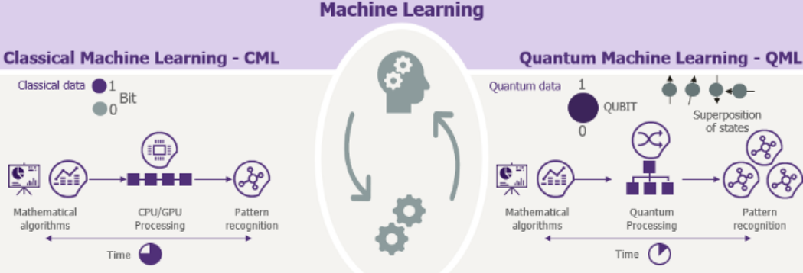

## Motivation

As part of the IBM Challenge, our goal was not just to tackle the QIMP problem but also to propose potential applications and further researches. While working on the challenge we realized that the challenge at the heart of it is inability of classical computers to perform large computations. In today's data driven world, it becomes essential to address this problem. Machine learning with its innumerable applications faces this problem. This problem is addressed under what we know as an emerging field- Quantum Machine Learning. Quantum Machine Learning(QML) explores the implementation of ML algorithms using quantum computers. We could identify several areas of research in industry and academia where QML solutions are being explored. The bet QML makes is to offer a [qantum speedup](https://arxiv.org/pdf/1611.09347.pdf).

More significantly, recent product launches and other announcements by Amazon Web Services, Microsoft, IBM, and Honeywell in the quantum computing space address AI and ML use cases to varying degrees. Recently, Google's launch of TensorFlow Quantum. This new software-only stack extends the widely adopted TensorFlow open-source ML library and modeling framework to support building and training of ML models to be processed on quantum computing platforms. These emerging trends indicate the importance of integrating existing ML frameworks to current quantum hardwares/clouds too.

## Business Applications and Potential Research Applications

It has been shown that quantum counterparts of several classical ML algorithms provide speedup.

Here we list few areas of research where QML is significantly being explored and can potentially gain advantage from these techniques.

1. Mapping out molecules and atoms for the creation of new materials by [applying ML](https://pubs.acs.org/doi/10.1021/acs.nanolett.9b04090) to accelerate material discovery, including the use of active learning to guide experimental design.

2. Modeling molecular interactions at an atomic level, allowing new pharmaceuticals and [medical research.](https://doi.org/10.1038/s41570-020-0189-9)
 
3. [NASA’ s QuAIL](https://ntrs.nasa.gov/search.jsp?R=20180001867) is a laboratory dedicated to study and develop use of quantum computing to improve performance and implementations of existing AI algorithms to assist in handling data.  

4. Enchancing the patterns of [recognitions and classification.](https://arxiv.org/abs/1804.11326)

5. Examining the potential cataclysmic growth of Big Data and AI with [Quantum Computing](https://link.springer.com/article/10.1186/s40537-019-0202-7).

5. Efficient image and video processing encoded in qubits and further securely transmitting through networks protected by quantum technology.

## Business Cases

1. [Airbus](https://www.airbus.com/innovation/industry-4-0/quantum-technologies.html) is interested in the QIMP for sorting and analyzing images 
streamed by satellites. Thus, QIMP can be applied to classify satellites images.

2. [AT&T](https://about.att.com/innovationblog/2018/12/building_a_quantum_network.html) announced that it  builds out its quantum networking technology
for secure communications. AT&T is in a potential need of quantum image processing and encoding.

3. [Boxcat](http://boxc.at/) leverages the power of quantum computing to render images and videos faster, cheaper, and more efficiently than current methods. 
They are targeting the media and medical imaging industries as potential customers for their solution. Provided one of the first 
experimental result in the very first image being rendered with the support of a quantum computer (D-Wave 2000Q)
