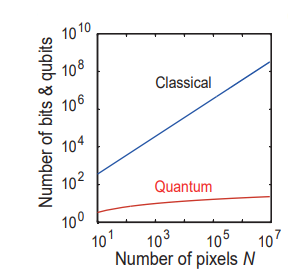

## Tackling the IBM Challenge
Our team has tackled the IBM Challenge to classify a large existing dataset of galaxy images using Quantum Machine Learning techniques. Quantum Image Processing(QIMP) is an emerging field in Quantum Information Processing and is set to provide speedup over its classical counterparts[1] The datasets are ever-increasing and with limited classical computational resources, it becomes important to explore methods to tackle this challenge.

## Why was it a Challenge 
Classification of large data requires large computational resources !

## The Solution we propose
Link to file with little details here
### workflow

The Support Vector Machine(SVM) is a common algorithm used in supervised learning process. Given  labeled training data, it outputs an optimal hyperplane which is able to categorize new examples. It can be generalized to nonlinear hyper-surfaces via kernel methods allowing it perform even in higher dimensions[2]. However, if the dimensions in which data points are projected, it becomes difficult for classical computers to compute through large computations. The quantum counterpart of the SVM- the **Quantum Support Vector Machines(QSVM)**[3] takes the classical machine learning algorithm and performs the support vector machine on a quantum circuit in order to be efficiently processed on a quantum computer. QSVM is shown to provide an exponential speedup *O(log N)* relative to its classical counterpart.
The figure below shows comparison of resource costs of classical and quantum image processing for an image of N (i.e., n = log2 N) pixel.

## Implications of the Solution
The solution we provide addresses an important problem of lack of computational capabilities. We explore the importance of Quantum Machine Learning techniques in the context of Quantum Image Processing and extend its potential applications to several other fields like space exploration, nanotechnology, material design, medical research etc. 
The Quantum Support Vector Machine

Link to An extensive document detailing potential applications 

## Future work and possibilities 
Exploring other platforms
